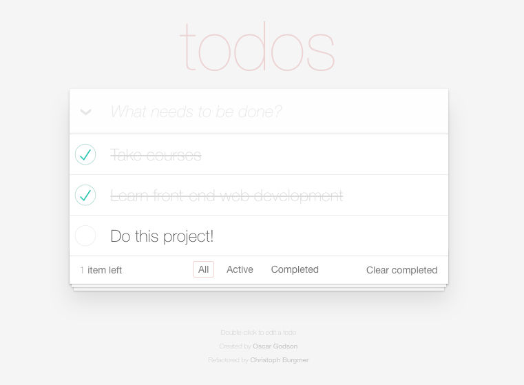
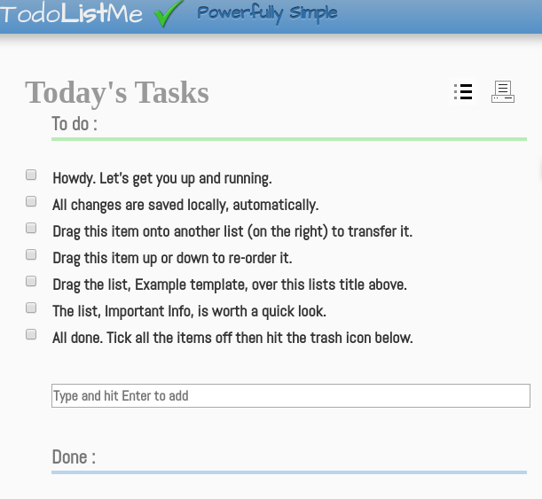

# Openclassrooms Project 8 

##Introduction :

This project is quite common, as OpenClassrooms' project 5 (the quote
generator) was. It consists in building a todo-app to help users organize their
lives better. It was coded using HTML5, CSS3 and JavaScript. As the app uses
the MVC architecture. The concept will be defined in Step 4.

It also consists in enhancing an existing JS project.  There are a few
bugs to fix and the overall performance may be improved too. There are tests to
be added, a performace analysis to write, and finally you may find the
documentation in Step 4.

## Contents
* Step 1 : Fix the bugs [See project_report.doc]
* Step 2 : Add tests [See project_report.doc]
* Step 3 : Analyse performance [See project_report.doc]
* Step 4 : Technical documentation
- Getting started :
	1. Requirements
	2. Planning
	3. Installing
	4. How-to
	5. Upgrading
	6. Troubleshooting
	7. Contributing

## Step 1 : Fix the bugs 
There are 2 bugs in the code which prevent it from
working properly :

* The first is a mere typo in a JS file

* The other is a problem with an ID in index.html.

There is an easy way to find these two errors. You can run your files through 
validators like w3validator (for your html) and JSHint for your JS files.

## Step 2 : Add tests 
[see project report.doc]

## Step 3 : Analyze performance

This step consists in analyzing the performance of a competitor's app at
http://todolistme.net/

## Step 4 : Technical documentation

### Getting started with the app :

#### Requirements :
* First and foremost, this is not an app which you want to run with a
	mobile phone. It would not be the worst experience you would have with an
	app, but it clearly has not been designed for a mobile experience. You
	would need to zoom in quite a lot to enjoy it properly. 

* A computer & a functional web browser like chromium, firefox, vivaldi,
	opera... The most reknowned which you are already familiar with, no
	doubt.

* Git : If you don't know how to install it, see TROUBLESHOOTING section

* NPM (Node Package Manager) If you don't know how to install it, see TROUBLESHOOTING section

* An http server : If you don't know how to install it, see TROUBLESHOOTING section

* Optional : Jasmine (for those who want to run the tests)

#### Planning

1. Concepts
	* Definition of MVC :
	It stands for Model-View-Controller. According to our almighty best friend
	wikipedia, it is "a pattern used for developing user interfaces which divides
	the related program logic into three interconnected elements. This is done to
	separate internal representations of information from the ways information is
	presented to and accepted from the user. This kind of pattern is used for
	designing the layout of the page."
	
	In case you are more of a visual person, I added a picture to make this
	definition crystal clear.

	

2. Architecture

	+ index.html
	There are 2 stylesheets coming from the node_modules. One is named base.css
	and another index.css.  I also added a favicon of my making, only to fix
	the error my http-server was throwing back at me.  In the html, you will
	find a main section with a class "todoapp", containing the whole app.  In
	the footer, you will find links to 7 JavaScript files and one more from the
	node_modules.

	+ app.js : main JS file 
	The whole app is contained within an anonymous function. That function
	contains in turn 2 functions : Todo() and setView(). Todo() takes one
	parameter "name", whilst setView() takes none. 

	As app.js needs all the other JS files to work properly, it is only logical
	that it is the last one being called in the html. Otherwise, it would not
	be able to create an instance of the 5 classes defined below, as they would
	not have been defined yet.

	1. Storage
	2. Model
	3. Template
	4. View
	5. Controller

	Every one of these are properties of Todo() and they contain a new instance
	of the class they're refering to. That is Store, Model, Template, View and
	Controller. 

	+ store.js

	All the code is contained within an anonymous function, just like for
	app.js. That function takes the window as sole parameter. This file plays
	the role of a fake database instead of what should normally be AJAX calls
	in real life. The function Store() takes 2 parameters : a name, and a
	callback. If you don't know what a callback is, here is a quick definiton :
	A callback function is a function passed into another function as an
	argument, which is theninvoked inside the outer function to complete some
	kind of routine or action. If you want to know more, click on this link :
	https://developer.mozilla.org/en-US/docs/Glossary/Callback_function

	+ model.js
	This is the central component of the MVC. It represents the app's structure
	(in terms of data) and it is not dependant on the user's interface. This is
	where all the management of the data takes place.

	+ helper.js
	Since helper.js is shared across everything, it allows the sharing and
	keeping of the logic across of the controller and the view in one place. It
	also helps us keep logic within the controller and the view lean.

	+ template.js
	A template lets web designers and developers work with web templates to
	automatically generate custom web pages, such as the results from a search.
	It reuses static web page elements while defining dynamic elements based on
	web request parameters. This file is a vanillaJS example of what would
	usually be done with a web template system such as Mustache. 

	+ view.js
	As its name suggests, this JS file is in charge of the view of the app. In
	other words, what is rendered to the screen. This is what constitutes your
	experience as a user. The app would be much less beautiful without it.

	+ controller.js
	The controller acts as some sort of intermediary between the model and the
	view. It receives the input from the user and passes it on to the model.

	+ node modules
	They are the same as JavaScript libraries. They are a set of functions
	which you can include in your app.  I have only included three of these
	modules : todomvc-common, jasmine-core and todomvc-css.

3. Deployment

If you do not wish to install it, the app will soon be deployed at this address :
https://soimuen11.github.io/OC_P8/

4. System requirements

You can run this app in any browser. It's as simple as that.

#### Installing

1. Turn on your web browser

2. go to github.com/Soimuen11/OC_P8

3. Click on the green button "clone or download"
	
4. Copy the URL within the text area
	
5. Open the CLI
	
6. You are now in your home directory. You can check by running :
	* ls
	* pwd
7. Type "cd Documents"
	
8. Then create a folder called "Projects" with "mkdir Projects"
	
9. Then cd Projects
	
10. Then git clone https://github.com/Soimuen11/OC_P8.git

#### How-to

If you find this app not user-friendly or intuitive enough, this section is for
you.

When you fire up the app, the first thing you should lay your eyes on is a text-area.
You want to fill it up with a to-do item. You need to go to the grocery store ? Put it in there and press "enter". That's it, you have your first to-do list up and running. Now you can add as many items as you like with this method. You can also tick them off to mark them as completed items.

If you click on "Active", you will only see the items you haven't completed. You can also click on "All" to see both completed and uncompleted items, or click on "Completed" to look at everything you have accomplished. 

I hope this app helps you out ;)

#### Upgrading

No upgrade, migration or configuration have been planned yet. If you want to be
warned whenever this project gets updated, you can "watch" this project on
github. Provided you have a gitHub account. If you do, you will be emailed if
and when I modify something in the code or add a new functionality.

#### Troubleshooting

##### Help ! How do I install GIT ?
	
* Debian and Ubuntu: sudo apt-get install git
	
* CentOS: sudo yum install git
	
* Fedora: sudo yum install git-core
	
* Arch Linux: sudo pacman -Sy git
	
* Gentoo: sudo emerge --ask --verbose dev-vcs/git
	
* MAC & WINDOWS :

	+ https://git-scm.com/book/en/v2/Getting-Started-Installing-Git
	+ https://www.linode.com/docs/development/version-control/how-to-install-git-on-linux-mac-and-windows/

##### Help ! How do I set up the http server : 
* RUN npm install -g http-server

##### I want to run the tests, how do I do

* RUN npm install -g jasmine (as jasmine-node is deprecated. It is recommended to use this package or jasmine-npm).
* No need to run "jasmine init" as the project is already initialized
* [OPTIONAL] RUN "jasmine examples" to  generate example spec and test files
* No config needed, it's already done
* RUN jasmine test/ControllerSpec.js OR "browser-name" test/SpecRunner.html
* For further issues, go there : https://jasmine.github.io/setup/nodejs.html

##### I see an error 404 concerning learn.json
* There currently is an issue coming from the node modules which has not yet
  been fixed : Error 404, failing to load learn.json. It will not prevent you
  from using the app but it will be fixed in an update very soon. As this
  module is an external library, it is not possible for me to give you an
  accurate date regarding this fix.

#### Contributing

This app being opensource, you are free to work on it in your own git fork.
You may have noticed that it needs a serious makeover. It was written in
EcmaScript 5, so that would deserve to be turned into ES6 (at the very least).
Its performance would doubtlessly improve.

I currently do not have the time for further developing it, so feel free !
